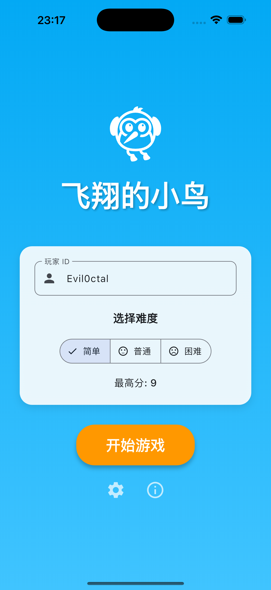
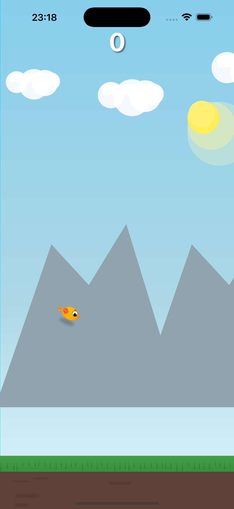
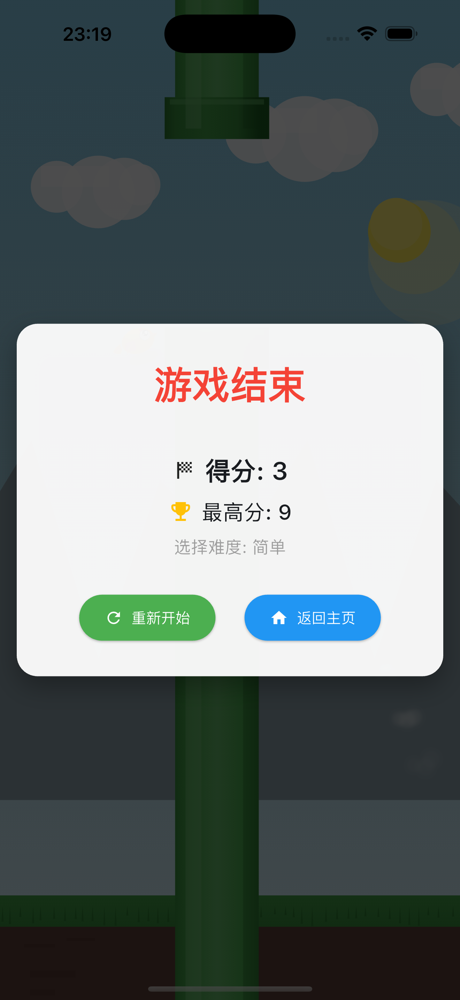
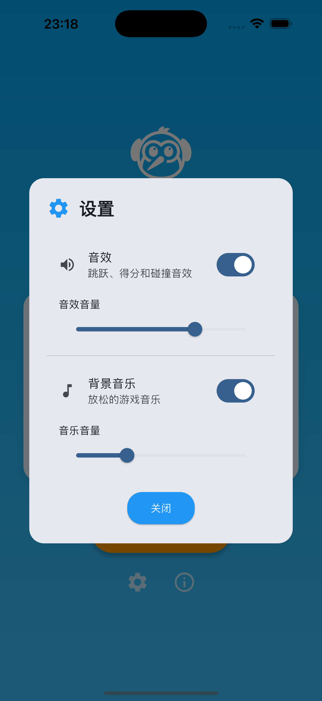
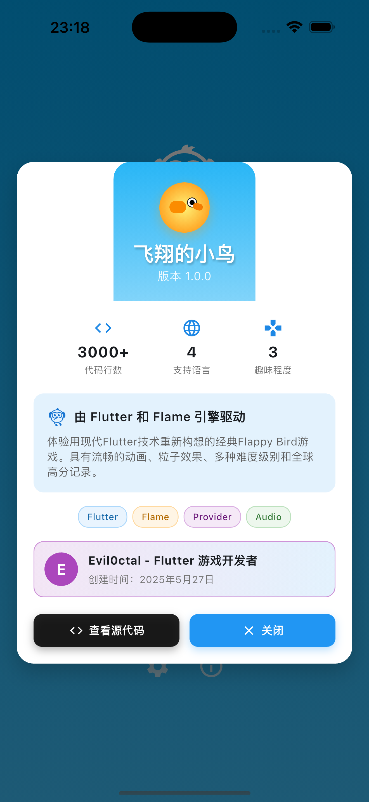

# 🐦 Flutter游戏开发教程：从零开始打造Flappy Bird

[](https://flutter.dev)
[](https://flame-engine.org)
[](#)
[](#)

> 🎓 **完整的Flutter游戏开发教程项目** - 从零基础到完整游戏，手把手教你使用Flutter和Flame引擎开发现代移动游戏

## 📸 游戏截图

<table>
  <tr>
    <td align="center">
      
      <br/>主菜单界面
    </td>
    <td align="center">
      
      <br/>游戏进行中
    </td>
    <td align="center">
      
      <br/>游戏结束界面
    </td>
  </tr>
  <tr>
    <td align="center">
      
      <br/>设置界面
    </td>
    <td align="center">
      
      <br/>信息界面
    </td>
    <td align="center">
      
      <br/>游戏运行动图
    </td>
  </tr>
</table>

## 📚 教程概述

这是一个专为**初学者设计的Flutter游戏开发教程项目**。通过重新制作经典的Flappy Bird游戏，你将学到：

- ✅ Flutter基础知识和进阶技巧
- ✅ Flame游戏引擎的使用方法
- ✅ 2D游戏开发的完整流程
- ✅ 物理模拟、动画和特效制作
- ✅ 音频系统和数据持久化
- ✅ 国际化和跨平台部署

## 🎯 学习目标

### 📖 基础知识（适合Flutter新手）
- Flutter环境搭建和项目创建
- Widget的组合和布局设计
- 状态管理和页面导航
- 动画和自定义绘制

### 🎮 游戏开发核心
- Flame游戏引擎基础
- 游戏循环和组件系统
- 物理模拟（重力、碰撞检测）
- 精灵动画和渲染技术

### 🌟 进阶特性
- 粒子系统设计
- 音频管理和循环播放
- 多语言国际化
- 性能优化技巧

## 🚀 准备工作

### 环境要求
```bash
# 检查Flutter版本
flutter --version
# 需要Flutter 3.8+

# 检查开发环境
flutter doctor
```

### 必要的开发工具
- **Flutter SDK 3.8+**
- **Android Studio** 或 **VS Code**
- **iOS Simulator**（Mac用户）或 **Android模拟器**
- **Git**（用于版本控制）

### 快速开始
```bash
# 1. 克隆教程项目
git clone https://github.com/Evil0ctal/Flappy-Bird-Flutter.git
cd Flappy-Bird-Flutter

# 2. 安装依赖
flutter pub get

# 3. 运行项目
flutter run
```

## 📋 教程大纲

### 第一章：项目基础搭建
1. [创建Flutter项目](#第一章创建flutter项目)
2. [添加Flame游戏引擎](#添加flame游戏引擎)
3. [项目结构设计](#项目结构设计)
4. [基础页面搭建](#基础页面搭建)

### 第二章：游戏核心组件
5. [创建游戏主类](#第二章创建游戏主类)
6. [实现小鸟组件](#实现小鸟组件)
7. [制作管道障碍](#制作管道障碍)
8. [设计滚动背景](#设计滚动背景)

### 第三章：游戏逻辑实现
9. [物理系统与重力](#第三章物理系统与重力)
10. [碰撞检测系统](#碰撞检测系统)
11. [得分系统](#得分系统)
12. [游戏状态管理](#游戏状态管理)

### 第四章：用户界面设计
13. [主菜单界面](#第四章主菜单界面)
14. [游戏倒计时](#游戏倒计时)
15. [游戏结束界面](#游戏结束界面)
16. [设置和关于页面](#设置和关于页面)

### 第五章：音效与特效
17. [音频系统设计](#第五章音频系统设计)
18. [粒子特效系统](#粒子特效系统)
19. [动画与过渡效果](#动画与过渡效果)

### 第六章：数据存储与设置
20. [本地数据存储](#第六章本地数据存储)
21. [高分记录系统](#高分记录系统)
22. [游戏设置功能](#游戏设置功能)

### 第七章：国际化与优化
23. [多语言支持](#第七章多语言支持)
24. [性能优化技巧](#性能优化技巧)
25. [跨平台适配](#跨平台适配)

---

## 第一章：创建Flutter项目

### 🎯 学习目标
- 掌握Flutter项目创建流程
- 了解项目目录结构
- 配置游戏开发依赖

### 步骤1：创建新项目
```bash
# 创建Flutter项目
flutter create flappy_bird_flutter
cd flappy_bird_flutter

# 测试项目是否正常运行
flutter run
```

### 添加Flame游戏引擎

编辑 `pubspec.yaml` 文件，添加游戏开发必需的依赖：

```yaml
dependencies:
  flutter:
    sdk: flutter
  flutter_localizations:  # 国际化支持
    sdk: flutter
    
  # 游戏引擎
  flame: ^1.18.0
  
  # 音频播放
  audioplayers: ^6.0.0
  
  # 本地存储
  shared_preferences: ^2.2.3
  
  # 状态管理
  provider: ^6.1.2
  
  # 国际化
  intl: ^0.20.2
  
  # URL启动器
  url_launcher: ^6.2.5

dev_dependencies:
  flutter_test:
    sdk: flutter
  flutter_lints: ^5.0.0
  
  # 应用图标生成
  flutter_launcher_icons: ^0.13.1
```

### 项目结构设计

创建以下目录结构：

```
lib/
├── main.dart                    # 应用入口
├── game/                        # 游戏引擎组件
│   ├── flappy_game.dart        # 游戏主循环
│   ├── bird.dart               # 小鸟组件
│   ├── pipe.dart               # 管道组件
│   ├── background.dart         # 背景组件
│   ├── score_text.dart         # 分数显示
│   └── particle_system.dart    # 粒子系统
├── screens/                     # 用户界面
│   ├── home_screen.dart        # 主菜单
│   ├── countdown_screen.dart   # 倒计时页面
│   ├── game_over_screen.dart   # 游戏结束
│   ├── about_dialog.dart       # 关于对话框
│   └── settings_dialog.dart    # 设置对话框
├── services/                    # 业务逻辑
│   ├── audio_service.dart      # 音频管理
│   └── storage_service.dart    # 数据存储
├── l10n/                       # 国际化文件
└── utils/                      # 工具类
```

### 基础页面搭建

首先创建应用的入口文件 `lib/main.dart`：

```dart
import 'package:flutter/material.dart';
import 'package:flutter_localizations/flutter_localizations.dart';
import 'package:provider/provider.dart';
import 'services/storage_service.dart';
import 'screens/home_screen.dart';
import 'l10n/app_localizations.dart';

void main() async {
  WidgetsFlutterBinding.ensureInitialized();
  
  // 初始化存储服务
  final storageService = StorageService();
  await storageService.init();
  
  runApp(FlappyBirdApp(storageService: storageService));
}

class FlappyBirdApp extends StatelessWidget {
  final StorageService storageService;
  
  const FlappyBirdApp({super.key, required this.storageService});

  @override
  Widget build(BuildContext context) {
    return Provider.value(
      value: storageService,
      child: MaterialApp(
        title: 'Flappy Bird Flutter',
        theme: ThemeData(
          primarySwatch: Colors.blue,
          visualDensity: VisualDensity.adaptivePlatformDensity,
        ),
        home: const HomeScreen(),
        
        // 国际化配置
        localizationsDelegates: const [
          AppLocalizations.delegate,
          GlobalMaterialLocalizations.delegate,
          GlobalWidgetsLocalizations.delegate,
          GlobalCupertinoLocalizations.delegate,
        ],
        supportedLocales: const [
          Locale('en'), Locale('zh'), 
          Locale('ja'), Locale('es'),
        ],
      ),
    );
  }
}
```

---

## 第二章：创建游戏主类

### 🎯 学习目标
- 理解Flame游戏引擎的基本概念
- 创建游戏主循环
- 实现基本的游戏组件

### 游戏引擎基础知识

Flame游戏引擎的核心概念：
- **FlameGame**: 游戏主类，管理游戏循环
- **Component**: 游戏中的各种对象（小鸟、管道等）
- **GameWidget**: 将Flame游戏嵌入Flutter界面

### 创建游戏主类

创建 `lib/game/flappy_game.dart`：

```dart
import 'package:flame/game.dart';
import 'package:flame/events.dart';
import '../services/storage_service.dart';
import '../services/audio_service.dart';

// 定义游戏难度枚举
enum Difficulty { easy, normal, hard }

class FlappyGame extends FlameGame with TapDetector, HasCollisionDetection {
  final Difficulty difficulty;
  late AudioService audioService;
  
  // 游戏状态
  int score = 0;
  bool isGameOver = false;
  
  // 游戏参数
  double pipeSpawnTimer = 0;
  double pipeSpawnInterval = 2.0;
  
  FlappyGame({required this.difficulty});
  
  @override
  Future<void> onLoad() async {
    await super.onLoad();
    
    // 设置相机
    camera.viewfinder.visibleGameSize = size;
    
    // 初始化音频服务
    audioService = AudioService();
    await audioService.init();
    await audioService.startBackgroundMusic();
    
    // 这里将添加游戏组件...
  }
  
  @override
  void update(double dt) {
    super.update(dt);
    
    if (!isGameOver) {
      // 游戏逻辑更新
      _updateGameLogic(dt);
    }
  }
  
  void _updateGameLogic(double dt) {
    // 管道生成逻辑
    pipeSpawnTimer += dt;
    if (pipeSpawnTimer >= pipeSpawnInterval) {
      // 生成新管道
      pipeSpawnTimer = 0;
    }
  }
  
  @override
  void onTap() {
    if (!isGameOver) {
      // 小鸟跳跃逻辑
      audioService.playJump();
    }
  }
  
  void gameOver() {
    if (isGameOver) return;
    
    isGameOver = true;
    pauseEngine();
    audioService.playGameOver();
    audioService.pauseBackgroundMusic();
    
    // 显示游戏结束界面
    overlays.add('gameOver');
  }
  
  void reset() {
    score = 0;
    isGameOver = false;
    pipeSpawnTimer = 0;
    
    // 重置游戏组件...
    
    audioService.resumeBackgroundMusic();
    resumeEngine();
  }
}
```

### 💡 教学重点

**游戏循环理解：**
1. `onLoad()` - 游戏初始化，只执行一次
2. `update(dt)` - 每帧都执行，dt是时间间隔
3. `render()` - 渲染绘制（由组件自动处理）

**事件处理：**
- `TapDetector` - 处理屏幕点击
- `HasCollisionDetection` - 启用碰撞检测

---

## 实现小鸟组件

### 🎯 学习目标
- 学习自定义组件创建
- 掌握物理模拟基础
- 理解自定义绘制技术

### 小鸟物理系统

创建 `lib/game/bird.dart`：

```dart
import 'dart:math';
import 'package:flame/collisions.dart';
import 'package:flame/components.dart';
import 'package:flutter/material.dart';
import 'flappy_game.dart';

class Bird extends PositionComponent with CollisionCallbacks {
  final FlappyGame game;
  
  // 物理属性
  final double jumpForce = -320;  // 跳跃力度（负数向上）
  double velocity = 0;            // 当前速度
  double time = 0;               // 时间计数器
  
  // 动画属性
  double wingAngle = 0;          // 翅膀角度
  bool isFlapping = false;       // 是否在扇翅膀
  double flapDuration = 0;       // 扇翅膀持续时间
  double tailAngle = 0;          // 尾巴角度
  
  // 死亡动画
  bool isDying = false;
  double deathRotation = 0;
  double deathTime = 0;
  double birdOpacity = 1.0;
  
  Bird({required this.game}) : super(size: Vector2(40, 30));
  
  @override
  Future<void> onLoad() async {
    await super.onLoad();
    
    // 设置初始位置
    position = Vector2(game.size.x * 0.3, game.size.y * 0.5);
    anchor = Anchor.center;
    
    // 添加碰撞检测
    add(CircleHitbox(
      radius: 12,
      position: Vector2(20, 15),
    ));
  }
  
  @override
  void update(double dt) {
    super.update(dt);
    time += dt;
    
    if (!game.isGameOver) {
      _updatePhysics(dt);
      _updateAnimations(dt);
      _checkBoundaries();
    } else if (isDying) {
      _updateDeathAnimation(dt);
    }
  }
  
  void _updatePhysics(double dt) {
    // 应用重力
    velocity += game.gravity * dt;
    
    // 更新位置
    position.y += velocity * dt;
    
    // 根据速度调整角度（俯冲和上升效果）
    angle = (velocity / 500).clamp(-0.4, 0.4);
  }
  
  void _updateAnimations(double dt) {
    // 尾巴摆动
    tailAngle = sin(time * 3) * 0.1 + angle * 0.3;
    
    // 翅膀扇动动画
    if (isFlapping) {
      flapDuration += dt;
      wingAngle = sin(flapDuration * 25) * 0.4;
      
      if (flapDuration > 0.25) {
        isFlapping = false;
        flapDuration = 0;
      }
    } else {
      // 滑翔时翅膀轻微摆动
      wingAngle = sin(time * 2) * 0.05 + velocity / 1000;
    }
  }
  
  void _checkBoundaries() {
    // 上边界检查
    if (position.y <= size.y / 2) {
      position.y = size.y / 2;
      velocity = 0;
    }
    
    // 下边界检查
    if (position.y >= game.size.y - size.y / 2) {
      position.y = game.size.y - size.y / 2;
      if (!isDying) {
        startDeathAnimation();
        game.gameOver();
      }
    }
  }
  
  void jump() {
    velocity = jumpForce;
    isFlapping = true;
    flapDuration = 0;
  }
  
  void startDeathAnimation() {
    isDying = true;
    deathTime = 0;
    deathRotation = angle;
  }
  
  // 自定义绘制方法
  @override
  void render(Canvas canvas) {
    super.render(canvas);
    
    canvas.save();
    
    // 应用透明度（死亡动画）
    if (birdOpacity < 1.0) {
      canvas.saveLayer(
        Rect.fromLTWH(0, 0, size.x, size.y),
        Paint()..color = Colors.white.withValues(alpha: birdOpacity),
      );
    }
    
    // 绘制小鸟各部分
    _drawShadow(canvas);
    _drawTail(canvas);
    _drawWing(canvas, isBack: true);
    _drawBody(canvas);
    _drawWing(canvas, isBack: false);
    _drawHead(canvas);
    _drawEye(canvas);
    _drawBeak(canvas);
    
    // 恢复canvas状态
    if (birdOpacity < 1.0) {
      canvas.restore();
    }
    canvas.restore();
  }
  
  // 绘制小鸟身体
  void _drawBody(Canvas canvas) {
    final bodyGradient = RadialGradient(
      center: const Alignment(-0.3, -0.5),
      radius: 1.0,
      colors: [
        const Color(0xFFFFC107), // 金黄色
        const Color(0xFFFF9800), // 橙色
      ],
    );
    
    final bodyPaint = Paint()
      ..shader = bodyGradient.createShader(
        Rect.fromCenter(
          center: const Offset(20, 15),
          width: 32,
          height: 24,
        ),
      );
    
    // 绘制椭圆形身体
    canvas.drawOval(
      Rect.fromCenter(
        center: const Offset(20, 15),
        width: 32,
        height: 24,
      ),
      bodyPaint,
    );
  }
  
  // ... 其他绘制方法（眼睛、翅膀、尾巴等）
}
```

### 💡 教学重点

**物理模拟关键概念：**
1. **重力系统**: `velocity += gravity * dt`
2. **位置更新**: `position.y += velocity * dt`
3. **边界检测**: 防止小鸟飞出屏幕
4. **跳跃机制**: 给velocity赋负值实现向上运动

**自定义绘制技巧：**
1. 使用`Canvas`和`Paint`进行绘制
2. 渐变效果让图形更生动
3. 动画通过改变角度和位置实现
4. 分层绘制创建立体效果

---

## 制作管道障碍

### 🎯 学习目标
- 学习障碍物生成系统
- 掌握随机数生成和难度调节
- 理解对象生命周期管理

### 管道系统设计

创建 `lib/game/pipe.dart`：

```dart
import 'package:flame/collisions.dart';
import 'package:flame/components.dart';
import 'package:flutter/material.dart';
import 'flappy_game.dart';

// 单个管道组件
class Pipe extends PositionComponent with CollisionCallbacks {
  final bool isTop;
  
  Pipe({required this.isTop, required Vector2 pipeSize}) : super(size: pipeSize);
  
  @override
  Future<void> onLoad() async {
    await super.onLoad();
    
    // 添加碰撞检测
    add(RectangleHitbox());
  }
  
  @override
  void render(Canvas canvas) {
    super.render(canvas);
    
    // 创建管道渐变效果
    final gradient = LinearGradient(
      begin: Alignment.centerLeft,
      end: Alignment.centerRight,
      colors: [
        Colors.green.shade700,
        Colors.green.shade500,
        Colors.green.shade600,
      ],
    );
    
    final paint = Paint()
      ..shader = gradient.createShader(
        Rect.fromLTWH(0, 0, size.x, size.y),
      );
    
    // 绘制管道主体
    canvas.drawRect(
      Rect.fromLTWH(0, 0, size.x, size.y),
      paint,
    );
    
    // 绘制高光效果
    final highlightPaint = Paint()
      ..color = Colors.green.shade300.withValues(alpha: 0.5)
      ..style = PaintingStyle.stroke
      ..strokeWidth = 2;
    
    canvas.drawLine(
      const Offset(5, 0),
      Offset(5, size.y),
      highlightPaint,
    );
  }
}

// 管道组（上下管道的组合）
class PipeGroup extends PositionComponent {
  final FlappyGame game;
  final double gapSize;
  bool scored = false;
  
  late Pipe topPipe;
  late Pipe bottomPipe;
  
  PipeGroup({required this.game, required this.gapSize});
  
  @override
  Future<void> onLoad() async {
    await super.onLoad();
    
    // 随机生成间隙位置
    final random = Random();
    final gapY = random.nextDouble() * (game.size.y - gapSize - 200) + 100;
    
    // 创建上管道
    topPipe = Pipe(
      isTop: true,
      pipeSize: Vector2(80, gapY),
    );
    topPipe.position = Vector2(0, 0);
    add(topPipe);
    
    // 创建下管道
    bottomPipe = Pipe(
      isTop: false,
      pipeSize: Vector2(80, game.size.y - gapY - gapSize),
    );
    bottomPipe.position = Vector2(0, gapY + gapSize);
    add(bottomPipe);
    
    // 设置移动速度
    _setupMovement();
  }
  
  void _setupMovement() {
    // 管道从右向左移动
    final moveSpeed = 150.0; // 像素/秒
    
    add(
      MoveEffect.to(
        Vector2(-100, position.y), // 移动到屏幕左侧
        EffectController(
          duration: (game.size.x + 100) / moveSpeed,
          linear: true,
        ),
      ),
    );
  }
  
  @override
  void update(double dt) {
    super.update(dt);
    
    // 移动管道
    position.x -= 150 * dt;
    
    // 移出屏幕后自动移除
    if (position.x < -100) {
      removeFromParent();
    }
  }
}
```

### 管道生成系统

在 `FlappyGame` 中添加管道生成逻辑：

```dart
class FlappyGame extends FlameGame with TapDetector, HasCollisionDetection {
  // ... 其他代码
  
  // 根据难度调整管道参数
  double get pipeGapSize {
    switch (difficulty) {
      case Difficulty.easy:
        return 200;   // 简单：大间隙
      case Difficulty.normal:
        return 160;   // 普通：中等间隙
      case Difficulty.hard:
        return 120;   // 困难：小间隙
    }
  }
  
  double get pipeHorizontalGap {
    switch (difficulty) {
      case Difficulty.easy:
        return 300;   // 简单：管道间距大
      case Difficulty.normal:
        return 250;   // 普通：中等间距
      case Difficulty.hard:
        return 200;   // 困难：间距小
    }
  }
  
  void _updateGameLogic(double dt) {
    // 管道生成逻辑
    pipeSpawnTimer += dt;
    if (pipeSpawnTimer >= pipeSpawnInterval) {
      spawnPipe();
      pipeSpawnTimer = 0;
    }
    
    // 检查得分
    _checkScoring();
    
    // 清理过期管道
    _cleanupPipes();
  }
  
  void spawnPipe() {
    final pipeGroup = PipeGroup(
      game: this,
      gapSize: pipeGapSize,
    );
    add(pipeGroup);
    pipeGroup.position.x = size.x; // 在屏幕右侧生成
  }
  
  void _checkScoring() {
    final pipeGroups = children.whereType<PipeGroup>().toList();
    
    for (final pipeGroup in pipeGroups) {
      // 检查小鸟是否通过了管道
      if (!pipeGroup.scored && 
          pipeGroup.position.x + 40 < bird.position.x) {
        pipeGroup.scored = true;
        incrementScore();
      }
    }
  }
  
  void incrementScore() {
    score++;
    scoreText.updateScore(score);
    audioService.playScore();
    
    // 创建得分特效
    particleManager.createScoreParticles(scoreText, Vector2(size.x / 2, 80));
  }
}
```

### 💡 教学重点

**障碍物系统设计：**
1. **组合模式**: PipeGroup包含上下两个Pipe
2. **随机生成**: 使用Random类生成不同高度的间隙
3. **对象池概念**: 自动移除离开屏幕的管道节省内存
4. **难度调节**: 通过改变间隙大小和间距调整难度

**性能优化技巧：**
1. 及时移除不需要的对象
2. 使用对象池重用对象（进阶技巧）
3. 合理的碰撞检测形状选择

---

## 第三章：物理系统与重力

### 🎯 学习目标
- 深入理解游戏物理原理
- 掌握重力系统实现
- 学习碰撞检测机制

### 物理系统核心概念

```dart
// 在FlappyGame中定义重力参数
double get gravity {
  switch (difficulty) {
    case Difficulty.easy:
      return 980;   // 较小的重力
    case Difficulty.normal:
      return 1200;  // 标准重力
    case Difficulty.hard:
      return 1500;  // 较大的重力
  }
}
```

### 碰撞检测系统

```dart
class Bird extends PositionComponent with CollisionCallbacks {
  // ... 其他代码
  
  @override
  void onCollision(Set<Vector2> intersectionPoints, PositionComponent other) {
    super.onCollision(intersectionPoints, other);
    
    // 检测与管道的碰撞
    if (other is Pipe && !game.isGameOver && !isDying) {
      game.audioService.playHit();
      
      // 创建碰撞特效
      game.particleManager.createHitParticles(this, position);
      
      // 开始死亡动画
      startDeathAnimation();
      
      // 游戏结束
      game.gameOver();
    }
  }
}
```

### 💡 教学重点

**物理模拟的核心公式：**
1. `速度 = 速度 + 加速度 * 时间`
2. `位置 = 位置 + 速度 * 时间`
3. 重力是一个持续向下的加速度

---

## 第四章：主菜单界面

### 🎯 学习目标
- 掌握Flutter界面设计
- 学习状态管理
- 理解导航系统

### 主菜单实现

创建 `lib/screens/home_screen.dart`：

```dart
import 'package:flutter/material.dart';
import 'package:provider/provider.dart';
import '../l10n/app_localizations.dart';
import '../services/storage_service.dart';
import '../services/audio_service.dart';
import 'countdown_screen.dart';

class HomeScreen extends StatefulWidget {
  const HomeScreen({super.key});

  @override
  State<HomeScreen> createState() => _HomeScreenState();
}

class _HomeScreenState extends State<HomeScreen> {
  final TextEditingController _playerIdController = TextEditingController();
  Difficulty _selectedDifficulty = Difficulty.normal;
  late StorageService _storageService;
  
  @override
  void initState() {
    super.initState();
    _storageService = context.read<StorageService>();
    _playerIdController.text = _storageService.playerId ?? '';
    _initAudio();
  }
  
  void _initAudio() async {
    final audioService = AudioService();
    await audioService.init();
    
    // 加载保存的设置
    final prefs = await _storageService.prefs;
    final musicEnabled = prefs.getBool('musicEnabled') ?? true;
    if (musicEnabled) {
      await audioService.startBackgroundMusic();
    }
  }
  
  void _startGame() async {
    final playerId = _playerIdController.text.trim();
    if (playerId.isEmpty) {
      ScaffoldMessenger.of(context).showSnackBar(
        SnackBar(
          content: Text(AppLocalizations.of(context)!.playerIdRequired),
        ),
      );
      return;
    }
    
    await _storageService.setPlayerId(playerId);
    
    if (mounted) {
      Navigator.push(
        context,
        MaterialPageRoute(
          builder: (context) => CountdownScreen(difficulty: _selectedDifficulty),
        ),
      );
    }
  }

  @override
  Widget build(BuildContext context) {
    return Scaffold(
      body: Container(
        decoration: const BoxDecoration(
          gradient: LinearGradient(
            begin: Alignment.topCenter,
            end: Alignment.bottomCenter,
            colors: [Colors.lightBlue, Colors.lightBlueAccent],
          ),
        ),
        child: SafeArea(
          child: Center(
            child: SingleChildScrollView(
              padding: const EdgeInsets.all(32.0),
              child: Column(
                mainAxisAlignment: MainAxisAlignment.center,
                children: [
                  // 游戏标题和图标
                  const Icon(
                    Icons.flutter_dash,
                    size: 100,
                    color: Colors.white,
                  ),
                  const SizedBox(height: 16),
                  Text(
                    AppLocalizations.of(context)!.appTitle,
                    style: const TextStyle(
                      fontSize: 48,
                      fontWeight: FontWeight.bold,
                      color: Colors.white,
                      shadows: [
                        Shadow(
                          blurRadius: 10.0,
                          color: Colors.black26,
                          offset: Offset(2.0, 2.0),
                        ),
                      ],
                    ),
                  ),
                  
                  const SizedBox(height: 48),
                  
                  // 游戏设置卡片
                  Container(
                    padding: const EdgeInsets.all(24),
                    decoration: BoxDecoration(
                      color: Colors.white.withValues(alpha: 0.9),
                      borderRadius: BorderRadius.circular(20),
                      boxShadow: [
                        BoxShadow(
                          color: Colors.black.withValues(alpha: 0.1),
                          blurRadius: 10,
                          offset: const Offset(0, 5),
                        ),
                      ],
                    ),
                    child: Column(
                      children: [
                        // 玩家ID输入
                        TextField(
                          controller: _playerIdController,
                          decoration: InputDecoration(
                            labelText: AppLocalizations.of(context)!.playerId,
                            hintText: AppLocalizations.of(context)!.enterNickname,
                            prefixIcon: const Icon(Icons.person),
                            border: OutlineInputBorder(
                              borderRadius: BorderRadius.circular(10),
                            ),
                          ),
                        ),
                        
                        const SizedBox(height: 24),
                        
                        // 难度选择
                        Text(
                          AppLocalizations.of(context)!.selectDifficulty,
                          style: const TextStyle(
                            fontSize: 18,
                            fontWeight: FontWeight.bold,
                          ),
                        ),
                        const SizedBox(height: 16),
                        
                        // 难度选择按钮
                        SegmentedButton<Difficulty>(
                          segments: [
                            ButtonSegment(
                              value: Difficulty.easy,
                              label: Text(AppLocalizations.of(context)!.easy),
                              icon: const Icon(Icons.sentiment_satisfied),
                            ),
                            ButtonSegment(
                              value: Difficulty.normal,
                              label: Text(AppLocalizations.of(context)!.normal),
                              icon: const Icon(Icons.sentiment_neutral),
                            ),
                            ButtonSegment(
                              value: Difficulty.hard,
                              label: Text(AppLocalizations.of(context)!.hard),
                              icon: const Icon(Icons.sentiment_very_dissatisfied),
                            ),
                          ],
                          selected: {_selectedDifficulty},
                          onSelectionChanged: (Set<Difficulty> newSelection) {
                            setState(() {
                              _selectedDifficulty = newSelection.first;
                            });
                          },
                        ),
                        
                        const SizedBox(height: 16),
                        
                        // 显示最高分
                        Text(
                          AppLocalizations.of(context)!.highScore(
                            _storageService.getHighScore(_selectedDifficulty)
                          ),
                          style: const TextStyle(
                            fontSize: 16,
                            fontWeight: FontWeight.w500,
                          ),
                        ),
                      ],
                    ),
                  ),
                  
                  const SizedBox(height: 32),
                  
                  // 开始游戏按钮
                  ElevatedButton(
                    onPressed: _startGame,
                    style: ElevatedButton.styleFrom(
                      backgroundColor: Colors.orange,
                      foregroundColor: Colors.white,
                      padding: const EdgeInsets.symmetric(
                        horizontal: 48,
                        vertical: 16,
                      ),
                      shape: RoundedRectangleBorder(
                        borderRadius: BorderRadius.circular(30),
                      ),
                      elevation: 5,
                    ),
                    child: Text(
                      AppLocalizations.of(context)!.startGame,
                      style: const TextStyle(
                        fontSize: 24,
                        fontWeight: FontWeight.bold,
                      ),
                    ),
                  ),
                ],
              ),
            ),
          ),
        ),
      ),
    );
  }
}
```

### 💡 教学重点

**界面设计原则：**
1. **视觉层次**: 使用大小、颜色、间距创建层次
2. **响应式设计**: 使用SingleChildScrollView适配不同屏幕
3. **用户体验**: 清晰的输入提示和错误处理
4. **视觉反馈**: 按钮的点击效果和阴影

---

## 第五章：音频系统设计

### 🎯 学习目标
- 掌握Flutter音频播放
- 学习单例模式应用
- 理解资源管理

### 音频服务实现

创建 `lib/services/audio_service.dart`：

```dart
import 'package:audioplayers/audioplayers.dart';
import 'package:flutter/foundation.dart';

class AudioService {
  static final AudioService _instance = AudioService._internal();
  factory AudioService() => _instance;
  AudioService._internal();

  final AudioPlayer _sfxPlayer = AudioPlayer();
  final AudioPlayer _bgmPlayer = AudioPlayer();
  
  bool _soundEnabled = true;
  bool _musicEnabled = true;
  double _sfxVolume = 0.7;
  double _musicVolume = 0.3;

  // 公开的getter方法
  bool get soundEnabled => _soundEnabled;
  bool get musicEnabled => _musicEnabled;
  double get sfxVolume => _sfxVolume;
  double get musicVolume => _musicVolume;

  Future<void> init() async {
    await _sfxPlayer.setReleaseMode(ReleaseMode.stop);
    await _bgmPlayer.setReleaseMode(ReleaseMode.loop);
    
    await _sfxPlayer.setVolume(_sfxVolume);
    await _bgmPlayer.setVolume(_musicVolume);
  }

  // 播放跳跃音效
  Future<void> playJump() async {
    if (!_soundEnabled) return;
    try {
      await _sfxPlayer.play(AssetSource('sounds/jump.wav'));
    } catch (e) {
      debugPrint('播放跳跃音效出错: $e');
    }
  }

  // 播放得分音效
  Future<void> playScore() async {
    if (!_soundEnabled) return;
    try {
      await _sfxPlayer.play(AssetSource('sounds/score.wav'));
    } catch (e) {
      debugPrint('播放得分音效出错: $e');
    }
  }

  // 播放碰撞音效
  Future<void> playHit() async {
    if (!_soundEnabled) return;
    try {
      await _sfxPlayer.play(AssetSource('sounds/hit.wav'));
    } catch (e) {
      debugPrint('播放碰撞音效出错: $e');
    }
  }

  // 播放游戏结束音效
  Future<void> playGameOver() async {
    if (!_soundEnabled) return;
    try {
      await _sfxPlayer.play(AssetSource('sounds/game_over.wav'));
    } catch (e) {
      debugPrint('播放游戏结束音效出错: $e');
    }
  }

  // 开始播放背景音乐
  Future<void> startBackgroundMusic() async {
    if (!_musicEnabled) return;
    try {
      // 预加载音频以避免循环间隙
      await _bgmPlayer.setSource(AssetSource('sounds/background_music.mp3'));
      await _bgmPlayer.setReleaseMode(ReleaseMode.loop);
      await _bgmPlayer.resume();
    } catch (e) {
      debugPrint('播放背景音乐出错: $e');
    }
  }

  // 停止背景音乐
  Future<void> stopBackgroundMusic() async {
    await _bgmPlayer.stop();
  }

  // 暂停背景音乐
  Future<void> pauseBackgroundMusic() async {
    await _bgmPlayer.pause();
  }

  // 恢复背景音乐
  Future<void> resumeBackgroundMusic() async {
    if (!_musicEnabled) return;
    await _bgmPlayer.resume();
  }

  // 设置音效开关
  void setSoundEnabled(bool enabled) {
    _soundEnabled = enabled;
    if (!enabled) {
      _sfxPlayer.stop();
    }
  }

  // 设置音乐开关
  void setMusicEnabled(bool enabled) {
    _musicEnabled = enabled;
    if (enabled) {
      startBackgroundMusic();
    } else {
      stopBackgroundMusic();
    }
  }

  // 设置音效音量
  void setSfxVolume(double volume) {
    _sfxVolume = volume.clamp(0.0, 1.0);
    _sfxPlayer.setVolume(_sfxVolume);
  }

  // 设置音乐音量
  void setMusicVolume(double volume) {
    _musicVolume = volume.clamp(0.0, 1.0);
    _bgmPlayer.setVolume(_musicVolume);
  }

  // 释放资源
  void dispose() {
    _sfxPlayer.dispose();
    _bgmPlayer.dispose();
  }
}
```

### 💡 教学重点

**单例模式的应用：**
```dart
class AudioService {
  static final AudioService _instance = AudioService._internal();
  factory AudioService() => _instance;
  AudioService._internal();
  
  // 这样确保整个应用只有一个AudioService实例
}
```

**资源管理最佳实践：**
1. 在应用启动时初始化音频服务
2. 正确设置ReleaseMode避免内存泄漏
3. 使用try-catch处理音频播放错误
4. 在应用退出时释放资源

---

## 第六章：本地数据存储

### 🎯 学习目标
- 掌握SharedPreferences使用
- 学习数据持久化
- 理解异步编程

### 存储服务实现

创建 `lib/services/storage_service.dart`：

```dart
import 'package:shared_preferences/shared_preferences.dart';

enum Difficulty { easy, normal, hard }

class StorageService {
  late SharedPreferences _prefs;
  
  static const String _playerIdKey = 'player_id';
  static const String _highScoreEasyKey = 'high_score_easy';
  static const String _highScoreNormalKey = 'high_score_normal';
  static const String _highScoreHardKey = 'high_score_hard';
  
  // 提供prefs访问器供设置页面使用
  Future<SharedPreferences> get prefs async => _prefs;
  
  Future<void> init() async {
    _prefs = await SharedPreferences.getInstance();
  }
  
  // 获取玩家ID
  String? get playerId => _prefs.getString(_playerIdKey);
  
  // 设置玩家ID
  Future<void> setPlayerId(String id) async {
    await _prefs.setString(_playerIdKey, id);
  }
  
  // 获取最高分
  int getHighScore(Difficulty difficulty) {
    switch (difficulty) {
      case Difficulty.easy:
        return _prefs.getInt(_highScoreEasyKey) ?? 0;
      case Difficulty.normal:
        return _prefs.getInt(_highScoreNormalKey) ?? 0;
      case Difficulty.hard:
        return _prefs.getInt(_highScoreHardKey) ?? 0;
    }
  }
  
  // 设置最高分
  Future<void> setHighScore(Difficulty difficulty, int score) async {
    switch (difficulty) {
      case Difficulty.easy:
        await _prefs.setInt(_highScoreEasyKey, score);
        break;
      case Difficulty.normal:
        await _prefs.setInt(_highScoreNormalKey, score);
        break;
      case Difficulty.hard:
        await _prefs.setInt(_highScoreHardKey, score);
        break;
    }
  }
  
  // 如果需要的话更新最高分
  Future<bool> updateHighScoreIfNeeded(Difficulty difficulty, int newScore) async {
    final currentHighScore = getHighScore(difficulty);
    if (newScore > currentHighScore) {
      await setHighScore(difficulty, newScore);
      return true; // 返回true表示创造了新纪录
    }
    return false;
  }
}
```

### 💡 教学重点

**异步编程基础：**
```dart
// async/await关键字的使用
Future<void> init() async {
  _prefs = await SharedPreferences.getInstance();
}

// 正确处理异步调用
void _loadData() async {
  final score = storageService.getHighScore(Difficulty.easy);
  // 使用数据...
}
```

---

## 第七章：多语言支持

### 🎯 学习目标
- 掌握Flutter国际化
- 学习ARB文件格式
- 理解本地化流程

### 配置国际化

在 `pubspec.yaml` 中添加：

```yaml
flutter:
  generate: true
  
dependencies:
  flutter_localizations:
    sdk: flutter
  intl: ^0.20.2
```

创建 `l10n.yaml`：

```yaml
arb-dir: lib/l10n
template-arb-file: app_en.arb
output-localization-file: app_localizations.dart
```

### 创建翻译文件

创建 `lib/l10n/app_en.arb`（英文）：

```json
{
  "@@locale": "en",
  "appTitle": "Flappy Bird",
  "@appTitle": {
    "description": "The title of the application"
  },
  "playerId": "Player ID",
  "@playerId": {
    "description": "Label for player ID input"
  },
  "enterNickname": "Enter your game nickname",
  "selectDifficulty": "Select Difficulty",
  "easy": "Easy",
  "normal": "Normal",
  "hard": "Hard",
  "highScore": "High Score: {score}",
  "@highScore": {
    "description": "High score display",
    "placeholders": {
      "score": {
        "type": "int"
      }
    }
  },
  "startGame": "Start Game",
  "gameOver": "Game Over",
  "newRecord": "🎉 New Record!",
  "score": "Score: {score}",
  "tryAgain": "Try Again",
  "backToHome": "Back to Home",
  "playerIdRequired": "Please enter Player ID"
}
```

创建 `lib/l10n/app_zh.arb`（中文）：

```json
{
  "@@locale": "zh",
  "appTitle": "飞翔的小鸟",
  "playerId": "玩家 ID",
  "enterNickname": "输入你的游戏昵称",
  "selectDifficulty": "选择难度",
  "easy": "简单",
  "normal": "普通",
  "hard": "困难",
  "highScore": "最高分: {score}",
  "startGame": "开始游戏",
  "gameOver": "游戏结束",
  "newRecord": "🎉 新纪录！",
  "score": "得分: {score}",
  "tryAgain": "重新开始",
  "backToHome": "返回主页",
  "playerIdRequired": "请输入玩家 ID"
}
```

### 在代码中使用

```dart
import '../l10n/app_localizations.dart';

// 在Widget中使用
Text(AppLocalizations.of(context)!.appTitle)

// 带参数的文本
Text(AppLocalizations.of(context)!.highScore(score))
```

### 💡 教学重点

**国际化最佳实践：**
1. 所有用户可见的文本都应该国际化
2. 使用描述性的key名称
3. 为复杂文本提供上下文描述
4. 测试不同语言下的界面布局

---

## 🎓 学习总结

通过完成这个Flappy Bird项目，你已经掌握了：

### 🎯 Flutter核心技能
- **Widget组合**: 使用各种Flutter组件构建界面
- **状态管理**: Provider模式和组件状态管理
- **导航系统**: 页面间的跳转和数据传递
- **动画系统**: 补间动画和控制器使用
- **自定义绘制**: Canvas和Paint的使用

### 🎮 游戏开发技能
- **Flame引擎**: 游戏循环、组件系统、事件处理
- **物理模拟**: 重力、速度、碰撞检测
- **资源管理**: 音频、图片、内存管理
- **性能优化**: 对象池、及时清理、合理的更新频率

### 🛠️ 实用技能
- **项目架构**: 清晰的文件组织和职责分离
- **错误处理**: try-catch和异步错误处理
- **国际化**: 多语言支持和本地化
- **数据持久化**: 本地存储和设置管理

## 🚀 进阶学习建议

### 下一步可以尝试：
1. **网络功能**: 添加在线排行榜
2. **更多特效**: 粒子系统优化、shader效果
3. **新功能**: 道具系统、多种鸟类
4. **平台特性**: 推送通知、社交分享
5. **性能优化**: 帧率监控、内存优化

### 推荐学习资源：
- [Flutter官方文档](https://flutter.dev/docs)
- [Flame引擎文档](https://docs.flame-engine.org/)
- [Dart编程语言](https://dart.dev/guides)

## 📞 联系方式

- **作者**: Evil0ctal
- **GitHub**: [@Evil0ctal](https://github.com/Evil0ctal)
- **项目地址**: [https://github.com/Evil0ctal/Flappy-Bird-Flutter](https://github.com/Evil0ctal/Flappy-Bird-Flutter)

---

**🎉 恭喜你完成了Flutter游戏开发教程！**

*这只是你游戏开发之旅的开始，继续探索更多可能性吧！*

⭐ 如果这个教程对你有帮助，请给项目点个Star！